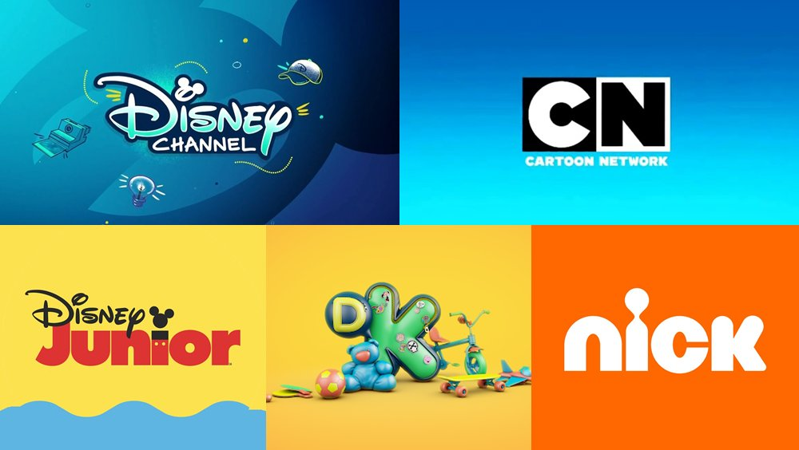
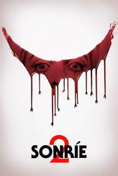

<!DOCTYPE html>
<html lang="es">
<head>
    <meta charset="UTF-8">
    <meta name="viewport" content="width=device-width, initial-scale=1.0">
    <title>TrotamundoTv</title>
    
    
</head>
<body>
    <!-- Formulario de Login -->
    

        

            <h2>Iniciar Sesión</h2>
            <input type="text" id="id" placeholder="ID de usuario">
            <input type="password" id="password" placeholder="Contraseña">
            <button onclick="login()">Ingresar</button>
        

    

    <!-- Contenedor Principal Después del Login -->
    

        

            <h1>TrotamundoTv</h1>
        

            <button onclick="showSection('home')">Inicio</button>
                <button onclick="showSection('channels')">TV Online</button>
                <button onclick="showSection('movies')">Películas</button>
                <button class="logout-button" onclick="logout()">Cerrar Sesión</button>
            

        

            

                <!-- Home Section with Carousel -->
                

                    

                        
                        
                        
                    

                

            <!-- Sección de Canales -->
            

                <h2>Canales</h2>
                

                    <!-- Canal 1 -->
                    

                        
                        <h4>Willax</h4>
                        <button onclick="loadVideo('https://geo.dailymotion.com/player.html?video=x7x4dgx')">Ver canal</button>
                    

                    <!-- Canal 2 -->
                    

                        
                        <h4>Direc Sport</h4>
                        <button onclick="loadVideo('https://nebunexa.co/red/?get=https://embed.sdfgnksbounce.com/embed2/directvsports.html')">Ver canal</button>
                    

                    <!-- Canal 3 -->
                    

                        
                        <h4>Latina</h4>
                        <button onclick="loadVideo('https://nebunexa.co/red/?get=https://embed.sdfgnksbounce.com/embed2/latina.html')">Ver canal</button>
                    

                    <!-- Canal 4 -->
                    

                        
                        <h4>panamericana</h4>
                        <button onclick="loadVideo('https://cdnhd.iblups.com/hls/ptv5.m3u8')">Ver canal</button>
                    

                     <!-- Canal 5 -->
                     

                        
                        <h4>America</h4>
                        <button onclick="loadVideo('https://nebunexa.co/red/?get=https://embed.sdfgnksbounce.com/embed2/americatv.html')">Ver canal</button>
                    

                    <!-- Canal 6 -->
                    

                        
                        <h4>golperu</h4>
                        <button onclick="loadVideo('https://gol12.com/vivo/canales.php?stream=golperu')">Ver canal</button>
                    

                    <!-- Canal 7 -->
                    

                        
                        <h4>atv</h4>
                        <button onclick="loadVideo('https://nebunexa.co/red/?get=https://embed.sdfgnksbounce.com/embed2/atv.html')">Ver canal</button>
                    

                    <!-- Canal 8 -->
                    

                        
                        <h4>Liga Max1</h4>
                        <button onclick="loadVideo('https://gol12.com/vivo/canales.php?stream=l1max')">Ver canal</button>
                    

                     <!-- Canal 9 -->
                     

                        
                        <h4>disney chanel</h4>
                        <button onclick="loadVideo('https://nebunexa.co/red/?get=https://embed.sdfgnksbounce.com/embed2/disneychannel.html')">Ver canal</button>
                    

                     <!-- Canal 10 -->
                     

                        
                        <h4>cartton network</h4>
                        <button onclick="loadVideo('https://nebunexa.co/red/?get=https://embed.sdfgnksbounce.com/embed2/cartoonnetwork.html')">Ver canal</button>
                    

                    <!-- Canal 11 -->
                    

                        
                        <h4>star chanel</h4>
                        <button onclick="loadVideo('https://nebunexa.co/red/?get=https://embed.sdfgnksbounce.com/embed2/starchannel.html')">Ver canal</button>
                    

                     <!-- Canal 12 -->
                     

                        
                        <h4>tnt hd</h4>
                        <button onclick="loadVideo('https://nebunexa.co/red/?get=https://embed.sdfgnksbounce.com/embed2/tnt.html')">Ver canal</button>
                    

                     <!-- Canal 13 -->
                     

                        
                        <h4>animad plane</h4>
                        <button onclick="loadVideo('https://nebunexa.co/red/?get=https://embed.sdfgnksbounce.com/embed2/animalplanet.html')">Ver canal</button>
                    

                     <!-- Canal 14 -->
                     

                        
                        <h4>histoty chanel</h4>
                        <button onclick="loadVideo('https://nebunexa.co/red/?get=https://embed.sdfgnksbounce.com/embed2/history.html')">Ver canal</button>
                    

                    <!-- Canal 15 -->
                    

                        
                        <h4>Disney Junior</h4>
                        <button onclick="loadVideo('https://nebunexa.co/red/?get=https://embed.sdfgnksbounce.com/embed2/disneyjr.html')">Ver canal</button>
                    

                    <!-- Canal 16 -->
                    

                        
                        <h4>Cartoonito</h4>
                        <button onclick="loadVideo('https://nebunexa.co/red/?get=https://embed.sdfgnksbounce.com/embed2/cartoonito.html')">Ver canal</button>
                    

                    <!-- Canal 17 -->
                    

                        
                        <h4>TNT Series</h4>
                        <button onclick="loadVideo('https://nebunexa.co/red/?get=https://embed.sdfgnksbounce.com/embed2/tntseries.html')">Ver canal</button>
                    

                     <!-- Canal 18 -->
                     

                        
                        <h4>Telemundo</h4>
                        <button onclick="loadVideo('https://nebunexa.co/red/?get=https://embed.sdfgnksbounce.com/embed2/telemundopuertorico.html')">Ver canal</button>
                    

                     <!-- Canal 19 -->
                     

                        
                        <h4>National Geographic</h4>
                        <button onclick="loadVideo('https://nebunexa.co/red/?get=https://embed.sdfgnksbounce.com/embed2/natgeo.html')">Ver canal</button>
                    

                

            

            <!-- Sección de Películas -->
            

                <h3>Películas</h3>
                

                    

                        
                        <h4>Garfield</h4>
                        <button onclick="loadVideo('https://nuuuppp.pro/watch/7kz7jIHYMkPnCGUQ5OVCQ3jz3s7kz70Y8cv7kz7kU4p45xzpNojXZmI?h=')">Ver película</button>
                    

                    

                        
                        <h4>winnie pooh 2</h4>
                        <button onclick="loadVideo('https://vidhidepro.com/v/p6zkbptnjokx')">Ver película</button>
                    

                    

                        
                        <h4>Alien: Romulus</h4>
                        <button onclick="loadVideo('https://vidhidepro.com/v/xhzx133jvb6t')">Ver película</button>
                    

                    

                        
                        <h4>El planeta de los simios: Nuevo reino</h4>
                        <button onclick="loadVideo('https://vidhidepro.com/v/xh1s090mn2wp')">Ver película</button>
                    

                    

                        
                        <h4>Godzilla y Kong: El nuevo imperio</h4>
                        <button onclick="loadVideo('https://swdyu.com/e/lxxfbxny2vsb')">Ver película</button>
                    

                    

                        
                        <h4>Deadpool & Wolverine</h4>
                        <button onclick="loadVideo('https://vidhidepro.com/v/5jlv210gxoid')">Ver película</button>
                    

                    

                        
                        <h4>Bad Boys: Hasta la muerte</h4>
                        <button onclick="loadVideo('https://vidhidepro.com/v/wy2w7lkpk98c')">Ver película</button>
                    

                    

                        
                        <h4>Chabuca</h4>
                        <button onclick="loadVideo('https://cdnplaypro.com/e/ap4r4jtogkl3')">Ver película</button>
                    

                    

                        
                        <h4>Sonríe 2</h4>
                        <button onclick="loadVideo('https://vidhidepro.com/v/583ml3ltd5bg')">Ver película</button>
                    

              
                

            

        

    

    <!-- Reproductor de Video (Ventana Grande) -->
    

        <button class="close-button" onclick="closeVideo()">✖</button>
        <button class="show-channels-button" onclick="toggleChannelList()">📺</button>
        <iframe id="video-player" frameborder="0" allowfullscreen></iframe>

        <!-- Lista de Canales dentro del reproductor -->
        

            <button onclick="loadVideo('https://geo.dailymotion.com/player.html?video=x7x4dgx')">Willax</button>
            <button onclick="loadVideo('https://nebunexa.co/red/?get=https://embed.sdfgnksbounce.com/embed2/directvsports.html')">Direct Sport</button>
            <button onclick="loadVideo('https://cdnhd.iblups.com/hls/ptv5.m3u8')">panamericana</button>
            <button onclick="loadVideo('https://atvenvivo.com/hls.php-93.html?get=Ly9qaXJlaC0yLWhscy12aWRlby11cy1pc3AuZHBzLmxpdmUvaGxzLXZpZGVvLzU2N2ZmZGUzZmEzMTlmYWRmMzQxOWVmZGEyNTYxOTQ1NjIzMWRmZWEvbGF0aW5hL2xhdGluYS5zbWlsL3BsYXlsaXN0Lm0zdTg/ZHBzc2lkPWIyNjg1MzMxMjAxNjZiZmYyYmJjNjMzNyZzaWQ9YmE1dDFsMXhiMjUzODA5MTY3MjY2YmZmMmJkOTk0OWUmbmR2Yz0w')">Latina</button>
            <button onclick="loadVideo('https://gol12.com/vivo/canales.php?stream=golperu')">golperu</button>
            <button onclick="loadVideo('https://atvenvivo.com/hls.php-89.html?get=Ly9hbGJhLXBlLWF0di1hdHYuc3RyZWFtLm1lZGlhdGlxdWVzdHJlYW0uY29tL2luZGV4Lm0zdTg=')">atv</button>
            <button onclick="loadVideo('https://gol12.com/vivo/canales.php?stream=l1max')">Liga Max1</button>
            <button onclick="loadVideo('https://nebunexa.co/red/?get=https://embed.sdfgnksbounce.com/embed2/disneychannel.html')">disney chanel</button>
            <button onclick="loadVideo('https://nebunexa.co/red/?get=https://embed.sdfgnksbounce.com/embed2/cartoonnetwork.html')">cartton network</button>
            <button onclick="loadVideo('https://nebunexa.co/red/?get=https://embed.sdfgnksbounce.com/embed2/starchannel.html')">star chanel</button>
            <button onclick="loadVideo('https://nebunexa.co/red/?get=https://embed.sdfgnksbounce.com/embed2/tnt.html')">tnt hd</button>
            <button onclick="loadVideo('https://nebunexa.co/red/?get=https://embed.sdfgnksbounce.com/embed2/animalplanet.html')">animad plane</button>
            <button onclick="loadVideo('https://nebunexa.co/red/?get=https://embed.sdfgnksbounce.com/embed2/history.html')">histoty chanel</button>
            <button onclick="loadVideo('https://nebunexa.co/red/?get=https://embed.sdfgnksbounce.com/embed2/disneyjr.html')">Disney Junior</button>
            <button onclick="loadVideo('https://nebunexa.co/red/?get=https://embed.sdfgnksbounce.com/embed2/cartoonito.html')">Cartoonito</button>
            <button onclick="loadVideo('https://nebunexa.co/red/?get=https://embed.sdfgnksbounce.com/embed2/tntseries.html')">TNT Series</button>
            <button onclick="loadVideo('https://nebunexa.co/red/?get=https://embed.sdfgnksbounce.com/embed2/telemundopuertorico.html')">Telemundo</button>
            <button onclick="loadVideo('https://nebunexa.co/red/?get=https://embed.sdfgnksbounce.com/embed2/natgeo.html')">National Geographic</button>

        

    

    <!-- Information Section (At the Bottom) -->
    

        <h3>👤💻 Cualquier mejora:</h3>
        

 <!-- Dynamic Paragraph -->
        <!-- WhatsApp Icon -->
        
    

</body>
</html>
