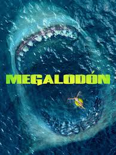

<!DOCTYPE html>
<html lang="es">
<head>
    <meta charset="UTF-8">
    <meta name="viewport" content="width=device-width, initial-scale=1.0">
    <title>TrotamundoTv</title>
    
    
</head>
<body>
    <!-- Login Form -->
    

        

            <h2>Iniciar Sesión</h2>
            <input type="text" id="id" placeholder="ID de usuario">
            <input type="password" id="password" placeholder="Contraseña">
            <button onclick="login()">Ingresar</button>
        

    

    <!-- Main Container After Login -->
    

        

            <h1>TrotamundoTv</h1>
            

                <button onclick="showSection('home')">Inicio</button>
                <button onclick="showSection('channels')">TV Online</button>
                <button onclick="showSection('movies')">Películas</button>
                <button class="logout-button" onclick="logout()">Cerrar Sesión</button>
            

        

        

            <!-- Home Section with Carousel -->
            

                

                    
                    
                    
                

            

            

                <h2>Canales</h2>
                

                    

                        
                        <h4>Willax</h4>
                        <button onclick="loadVideo('https://geo.dailymotion.com/player.html?video=x7x4dgx')">Ver canal</button>
                    

                    

                        
                        <h4>Latina</h4>
                        <button onclick="loadVideo('https://atvenvivo.com/hls.php-93.html?get=Ly9qaXJlaC0yLWhscy12aWRlby11cy1pc3AuZHBzLmxpdmUvaGxzLXZpZGVvLzU2N2ZmZGUzZmEzMTlmYWRmMzQxOWVmZGEyNTYxOTQ1NjIzMWRmZWEvbGF0aW5hL2xhdGluYS5zbWlsL3BsYXlsaXN0Lm0zdTg/ZHBzc2lkPWIyNjg1MzMxMjAxNjZiZmYyYmJjNjMzNyZzaWQ9YmE1dDFsMXhiMjUzODA5MTY3MjY2YmZmMmJkOTk0OWUmbmR2Yz0w')">Ver canal</button>
                    

                    

                        
                        <h4>panamericana</h4>
                        <button onclick="loadVideo('https://cdnhd.iblups.com/hls/ptv5.m3u8')">Ver canal</button>
                    

                     

                        
                        <h4>America</h4>
                        <button onclick="loadVideo('https://nebunexa.co/red/?get=https://embed.sdfgnksbounce.com/embed2/americatv.html')">Ver canal</button>
                    

                    

                        
                        <h4>golperu1</h4>
                        <button onclick="loadVideo('https://la10hd.com/tv/golperu.html')">Ver canal</button>
                    

                    

                        
                        <h4>golperu</h4>
                        <button onclick="loadVideo('https://gol12.com/vivo/canales.php?stream=golperu')">Ver canal</button>
                    

                    

                        
                        <h4>Direct Sport1</h4>
                        <button onclick="loadVideo('https://nebunexa.co/red/?get=https://micanaldeportivo.com/directvsports.php')">Ver canal</button>
                    

                    

                        
                        <h4>Direct Sport2</h4>
                        <button onclick="loadVideo('https://nebunexa.co/red/?get=https://embed.sdfgnksbounce.com/embed2/directvsports.html')">Ver canal</button>
                    

                    

                        
                        <h4>Ligamax1</h4>
                        <button onclick="loadVideo('https://la10hd.com/tv/liga1max.html')">Ver canal</button>
                    

                    

                        
                        <h4>Ligamax1.1</h4>
                        <button onclick="loadVideo('https://gol12.com/vivo/canales.php?stream=l1max')">Ver canal</button>
                    

                    

                        
                        <h4>atv</h4>
                        <button onclick="loadVideo('https://atvenvivo.com/hls.php-89.html?get=Ly9hbGJhLXBlLWF0di1hdHYuc3RyZWFtLm1lZGlhdGlxdWVzdHJlYW0uY29tL2luZGV4Lm0zdTg=')">Ver canal</button>
                    

                    

                        
                        <h4>discovery kids</h4>
                        <button onclick="loadVideo('https://tvlibreonline.net/html/clarovideo.html?r=DISKIDS')">Ver canal</button>
                    

                     

                        
                        <h4>cartton network</h4>
                        <button onclick="loadVideo('https://nebunexa.co/red/?get=https://embed.sdfgnksbounce.com/embed2/cartoonnetwork.html')">Ver canal</button>
                    

                    

                        
                        <h4>star chanel</h4>
                        <button onclick="loadVideo('https://nebunexa.co/red/?get=https://embed.sdfgnksbounce.com/embed2/starchannel.html')">Ver canal</button>
                    

                     

                        
                        <h4>tnt hd</h4>
                        <button onclick="loadVideo('https://nebunexa.co/red/?get=https://embed.sdfgnksbounce.com/embed2/tnt.html')">Ver canal</button>
                    

                     

                        
                        <h4>animad plane</h4>
                        <button onclick="loadVideo('https://nebunexa.co/red/?get=https://embed.sdfgnksbounce.com/embed2/animalplanet.html')">Ver canal</button>
                    

                     

                        
                        <h4>histoty chanel</h4>
                        <button onclick="loadVideo('https://nebunexa.co/red/?get=https://embed.sdfgnksbounce.com/embed2/history.html')">Ver canal</button>
                    

                    

                        
                        <h4>Disney Junior</h4>
                        <button onclick="loadVideo('https://nebunexa.co/red/?get=https://embed.sdfgnksbounce.com/embed2/disneyjr.html')">Ver canal</button>
                    

                    

                        
                        <h4>Cartoonito</h4>
                        <button onclick="loadVideo('https://nebunexa.co/red/?get=https://embed.sdfgnksbounce.com/embed2/cartoonito.html')">Ver canal</button>
                    

                    

                        
                        <h4>TNT Series</h4>
                        <button onclick="loadVideo('https://nebunexa.co/red/?get=https://embed.sdfgnksbounce.com/embed2/tntseries.html')">Ver canal</button>
                    

                     

                        
                        <h4>National Geographic</h4>
                        <button onclick="loadVideo('https://nebunexa.co/red/?get=https://embed.sdfgnksbounce.com/embed2/natgeo.html')">Ver canal</button>
                    

                

            

            

                <h3>Películas</h3>
                

                    

                        
                        <h4>Garfield</h4>
                        <button onclick="loadVideo('https://nuuuppp.pro/watch/7kz7jIHYMkPnCGUQ5OVCQ3jz3s7kz70Y8cv7kz7kU4p45xzpNojXZmI?h=')">Ver película</button>
                    

                    

                        
                        <h4>Venom3</h4>
                        <button onclick="loadVideo('https://uqload.net/embed-8j3csupwsnty.html')">Ver película</button>
                    

                    

                        
                        <h4>Back to Black</h4>
                        <button onclick="loadVideo('https://uqload.net/embed-2se7c04s9ia5.html')">Ver película</button>
                    

                    

                        
                        <h4>Aquaman y el reino perdido</h4>
                        <button onclick="loadVideo('https://asnwish.com/e/rcubldghkke8')">Ver película</button>
                    

                    

                        
                        <h4>Kung Fu Panda 4</h4>
                        <button onclick="loadVideo('https://jodwish.com/e/vs3upr0nt6bs')">Ver película</button>
                    

                    

                        
                        <h4>Oppenheimer</h4>
                        <button onclick="loadVideo('https://asnwish.com/e/yfeizpk9bu1k')">Ver película</button>
                    

                    

                        
                        <h4>Saw X</h4>
                        <button onclick="loadVideo('https://uqload.net/embed-q8m15ez359pl.html')">Ver película</button>
                    

                    

                        
                        <h4>Doctor Strange en el multiverso de la locura</h4>
                        <button onclick="loadVideo('https://uqload.net/embed-rm2n3u8wfz1k.html')">Ver película</button>
                    

                    

                        
                        <h4>Guasón</h4>
                        <button onclick="loadVideo('https://uqload.net/embed-u32uvhrvale8.html')">Ver película</button>
                    

                    

                        
                        <h4>Yo antes de ti</h4>
                        <button onclick="loadVideo('https://uqload.net/embed-i6ogeh2w5hah.html')">Ver película</button>
                    

                    

                        
                        <h4>El Rey León</h4>
                        <button onclick="loadVideo('https://uqload.net/embed-c3ftopv5nqel.html')">Ver película</button>
                    

                    

                        
                        <h4>Gato con Botas: El último deseo</h4>
                        <button onclick="loadVideo('https://uqload.net/embed-rvp3i5twjgoa.html')">Ver película</button>
                    

                    

                        
                        <h4>John Wick 4</h4>
                        <button onclick="loadVideo('https://uqload.net/embed-dqw9finfbw93.html')">Ver película</button>
                    

                    

                        
                        <h4>Megalodón1</h4>
                        <button onclick="loadVideo('https://uqload.net/embed-vt1all8l1gty.html')">Ver película</button>
                    

                    

                        
                        <h4>Megalodón2</h4>
                        <button onclick="loadVideo('https://uqload.net/embed-cb8o0xtaig7d.html')">Ver película</button>
                    

                    

                        
                        <h4>Alien: Romulus</h4>
                        <button onclick="loadVideo('https://uqload.net/embed-pz9stsy48d2h.html')">Ver película</button>
                    

                    

                        
                        <h4>Sismo magnitud 9.5</h4>
                        <button onclick="loadVideo('https://uqload.net/embed-jjsflhutm25v.html')">Ver película</button>
                    

                    

                        
                        <h4>El planeta de los simios: Nuevo reino</h4>
                        <button onclick="loadVideo('https://uqload.net/embed-ocon4alaq35r.html')">Ver película</button>
                    

                    

                        
                        <h4>Guerra Civil</h4>
                        <button onclick="loadVideo('https://uqload.net/embed-7jebr2qvb9tv.html')">Ver película</button>
                    

                    

                        
                        <h4>Beetlejuice Beetlejuice</h4>
                        <button onclick="loadVideo('https://uqload.net/embed-tnmqaw2bgkqr.html')">Ver película</button>
                    

                    

                        
                        <h4>Terrifier 3: Payaso Siniestro</h4>
                        <button onclick="loadVideo('https://hlswish.com/e/odvqzm85ot2z')">Ver película</button>
                    

                    

                        
                        <h4>Terrifier : Payaso Siniestro</h4>
                        <button onclick="loadVideo('https://uqload.net/embed-41v48hl5no9t.html')">Ver película</button>
                    

                    

                        
                        <h4>Winnie Pooh: Miel y Sangre1</h4>
                        <button onclick="loadVideo('https://uqload.net/embed-kbpwgv55k2k7.html')">Ver película</button>
                    

                    

                        
                        <h4>Winnie Pooh: Miel y Sangre2</h4>
                        <button onclick="loadVideo('https://uqload.net/embed-yulefh32jjg5.html')">Ver película</button>
                    

                    

                        
                        <h4>Misión de rescate 1</h4>
                        <button onclick="loadVideo('https://upstream.to/embed-igf16a3hl2ig.html')">Ver película</button>
                    

                    

                        
                        <h4>Misión de rescate 2</h4>
                        <button onclick="loadVideo('https://uqload.net/embed-76fvbnv9zf3n.html')">Ver película</button>
                    

                

            

        

    

    

        <button class="close-button" onclick="closeVideo()">✖</button>
        <button class="show-channels-button" onclick="toggleChannelList()">📺</button>
        <iframe id="video-player" frameborder="0" allowfullscreen></iframe>
        

            <button onclick="loadVideo('https://geo.dailymotion.com/player.html?video=x7x4dgx')">Willax</button>
            <button onclick="loadVideo('https://cdnhd.iblups.com/hls/ptv5.m3u8')">panamericana</button>
            <button onclick="loadVideo('https://atvenvivo.com/hls.php-93.html?get=Ly9qaXJlaC0yLWhscy12aWRlby11cy1pc3AuZHBzLmxpdmUvaGxzLXZpZGVvLzU2N2ZmZGUzZmEzMTlmYWRmMzQxOWVmZGEyNTYxOTQ1NjIzMWRmZWEvbGF0aW5hL2xhdGluYS5zbWlsL3BsYXlsaXN0Lm0zdTg/ZHBzc2lkPWIyNjg1MzMxMjAxNjZiZmYyYmJjNjMzNyZzaWQ9YmE1dDFsMXhiMjUzODA5MTY3MjY2YmZmMmJkOTk0OWUmbmR2Yz0w')">Latina</button>
            <button onclick="loadVideo('https://gol12.com/vivo/canales.php?stream=golperu')">golperu</button>
            <button onclick="loadVideo('https://atvenvivo.com/hls.php-89.html?get=Ly9hbGJhLXBlLWF0di1hdHYuc3RyZWFtLm1lZGlhdGlxdWVzdHJlYW0uY29tL2luZGV4Lm0zdTg=')">atv</button>
            <button onclick="loadVideo('https://nebunexa.co/red/?get=https://embed.sdfgnksbounce.com/embed2/americatv.html')">America</button>
            <button onclick="loadVideo('https://tvlibreonline.net/html/clarovideo.html?r=DISKIDS')">discovery kids</button>
            <button onclick="loadVideo('https://nebunexa.co/red/?get=https://embed.sdfgnksbounce.com/embed2/disneychannel.html')">disney chanel</button>
            <button onclick="loadVideo('https://nebunexa.co/red/?get=https://embed.sdfgnksbounce.com/embed2/cartoonnetwork.html')">cartton network</button>
            <button onclick="loadVideo('https://nebunexa.co/red/?get=https://embed.sdfgnksbounce.com/embed2/starchannel.html')">star chanel</button>
            <button onclick="loadVideo('https://nebunexa.co/red/?get=https://embed.sdfgnksbounce.com/embed2/tnt.html')">tnt hd</button>
            <button onclick="loadVideo('https://nebunexa.co/red/?get=https://embed.sdfgnksbounce.com/embed2/animalplanet.html')">animad plane</button>
            <button onclick="loadVideo('https://nebunexa.co/red/?get=https://embed.sdfgnksbounce.com/embed2/history.html')">histoty chanel</button>
            <button onclick="loadVideo('https://nebunexa.co/red/?get=https://embed.sdfgnksbounce.com/embed2/disneyjr.html')">Disney Junior</button>
            <button onclick="loadVideo('https://nebunexa.co/red/?get=https://embed.sdfgnksbounce.com/embed2/cartoonito.html')">Cartoonito</button>
            <button onclick="loadVideo('https://nebunexa.co/red/?get=https://embed.sdfgnksbounce.com/embed2/tntseries.html')">TNT Series</button>
            <button onclick="loadVideo('https://nebunexa.co/red/?get=https://embed.sdfgnksbounce.com/embed2/telemundopuertorico.html')">Telemundo</button>
            <button onclick="loadVideo('https://nebunexa.co/red/?get=https://embed.sdfgnksbounce.com/embed2/natgeo.html')">National Geographic</button>
            <button onclick="loadVideo('https://nebunexa.co/red/?get=https://embed.sdfgnksbounce.com/embed2/latina.html')">Latina1</button>
            <button onclick="loadVideo('https://la10hd.com/tv/golperu.html')">golperu1</button>
            <button onclick="loadVideo('https://la10hd.com/tv/liga1max.html')">Ligamax1</button>
            <button onclick="loadVideo('https://gol12.com/vivo/canales.php?stream=l1max')">Ligamax1.1</button>
            <button onclick="loadVideo('https://nebunexa.co/red/?get=https://micanaldeportivo.com/directvsports.php')">Direct Sport1</button>
            <button onclick="loadVideo('https://nebunexa.co/red/?get=https://embed.sdfgnksbounce.com/embed2/directvsports.html')">Direct Sport2</button>
        

    

    <!-- Information Section (At the Bottom) -->
    

        <h3>👤💻 Cualquier mejora:</h3>
        

 <!-- Dynamic Paragraph -->
        <!-- WhatsApp Icon -->
        
    

</body>
</html>

